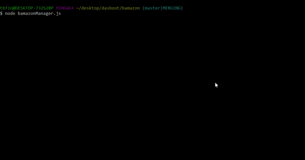
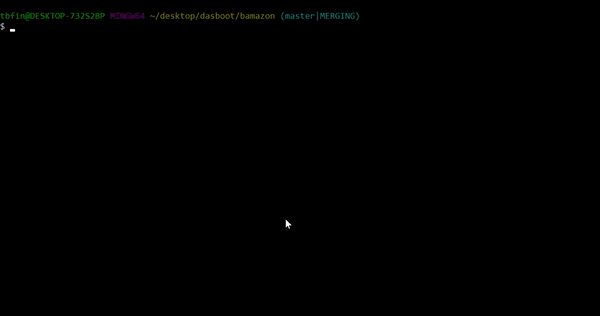

# Bamazon

This is a Amazon-like storefront using MySQL and inquirer.  The app takes in orders from customers and deplete stock from the store's inventory.

## Getting Started

Clone or download the files for local use and use gitbash or console to run.

### Prerequisites

```
node.js
terminal -or- gitbash

```

### Installing

Install is straight forward...

```
node install
```

then run bamazon.js

```
node bamazon.js
```



...or bamazonManager.js for the manager view

```
node bamazonManager.js
```



## Built With

* [node](https://nodejs.org/en/) - The web framework used 

## Authors

* **Tyler Finkle** - *Initial work* - [Bamazon](https://github.com/carltheape/bamazon)

## Acknowledgments

* Built for GA tech coding bootcamp
